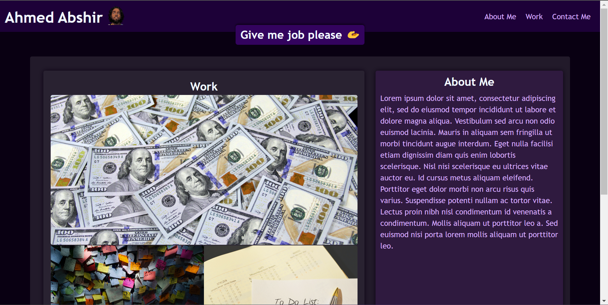
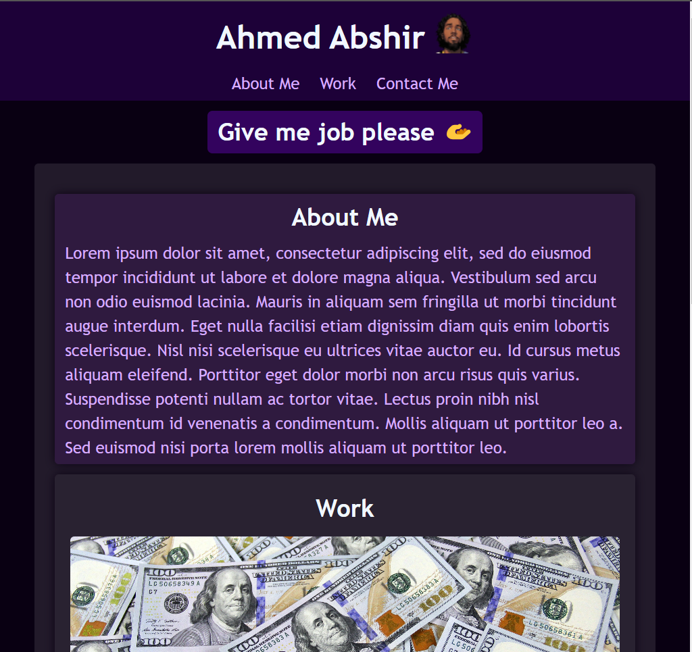
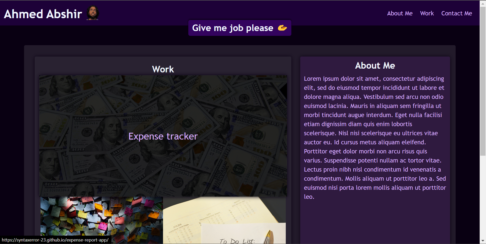

# My Portfolio 

<!-- About project -->
## About The Project

I have created a portfolio page to showcase some of the projects I have worked on in my brief experience with HTML, CSS and Javascript. 

## Usage

The page is composed of 4 sections:

1. Navigation bar
2. Work
3. About me 
4. Contact me

The CSS includes a media query which changes the way the webpage is rendered on screens with a width of 720px or smaller.

This screenshot below shows what the webpage first looks like when you access it on larger screens.

This next screenshot shows what the webpage looks when you first access it on smaller screens.

The navigation bar contains links to the various sections of the page. The work section also contains links to the projects mentioned above. I have styled these links (a tags) to respond when he cursor is hovering above them as shown in the screenshots below.

